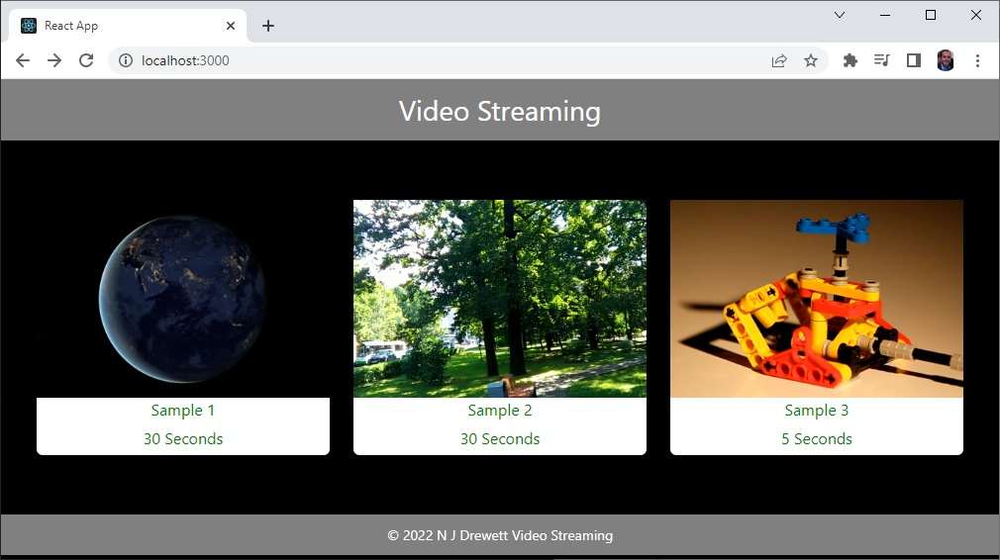
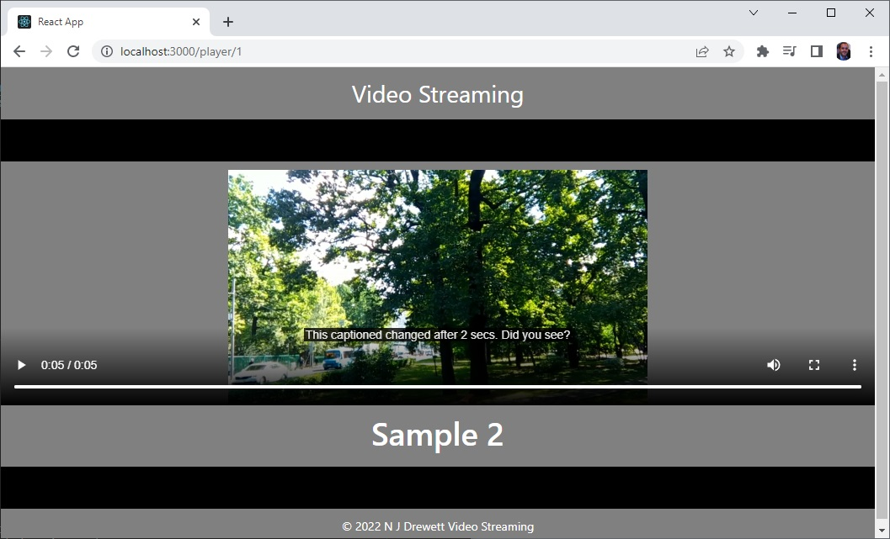

## Example React and Node.js Simple Video Streaming Application

This Application used FFMPEG which must be downloaded and its bin folder included on the environment path.

This is a simple Home Page requesting and showing the simple data base of video files available and a simple player application with closed caption display.

